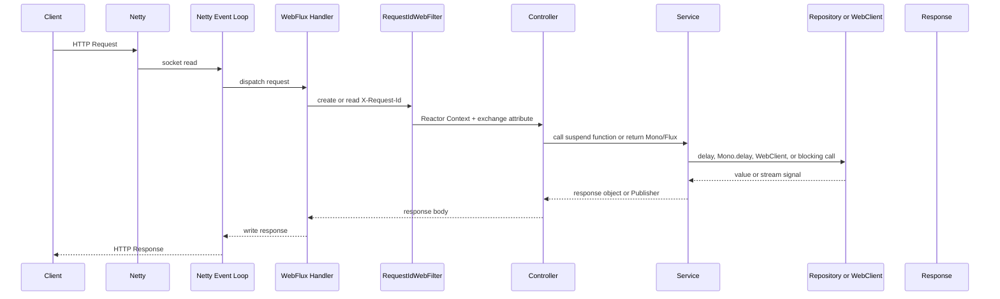

# WebFlux + Kotlin Coroutine + Reactor + Netty 실행 관찰 Demo

Spring Boot WebFlux, Kotlin Coroutine, Reactor, Netty Event Loop를 직접 실행하면서 관찰하기 위한 독립 예제입니다.

기존 `performace-test` Java 프로젝트와 섞지 않고, 루트 하위 `webflux-coroutine-demo/`에 별도 Gradle 프로젝트로 구성했습니다.

## 1. 이 예제의 목적

WebFlux를 제대로 이해하려면 Controller 코드만 보면 부족합니다. 실제 요청은 Netty Event Loop 위에서 들어오고, WebFlux는 Reactor Publisher를 구독하며, Kotlin `suspend fun`은 내부적으로 Reactor와 연결되어 non-blocking 흐름에 올라탑니다.

이 예제는 다음을 눈으로 확인하는 데 목적이 있습니다.

- 요청 하나가 `Controller -> Service -> Repository`를 지나며 어떤 스레드에서 실행되는지
- `Thread.sleep`이 event-loop에 들어가면 왜 위험한지
- `delay`가 왜 스레드를 점유하지 않는지
- `Schedulers.boundedElastic()`와 `Dispatchers.IO`로 blocking 작업을 우회시키면 스레드가 어떻게 바뀌는지
- `Mono`/`Flux`와 `suspend fun`/`Flow`가 언제 실행을 시작하는지
- `WebClient` self-call이 sequential/parallel에서 시간이 어떻게 달라지는지
- Reactor Context와 Coroutine Context가 어디까지 이어지고, 어디서 끊기는지

## 2. 전체 요청 흐름



코드 위치:

- `config/RequestIdWebFilter.kt`: requestId 생성, response header, Reactor Context 기록
- `controller/DemoController.kt`: 기본 흐름, blocking/non-blocking, Mono/Flux, suspend/Flow 엔드포인트
- `service/*Service.kt`: 실제 실험 로직
- `repository/DemoRepository.kt`: Repository 계층 로그와 delay/Mono.delay 실험

## 3. 정상 흐름

`/demo/hello` 요청 하나를 호출하면 다음 순서로 로그가 찍힙니다.

1. `web-filter`: 요청 ID 생성 또는 `X-Request-Id` 사용
2. `controller`: suspend controller 진입
3. `service`: service 호출
4. `repository`: `delay(50)` 전 로그
5. `repository`: `delay(50)` 후 로그
6. `service`: repository 결과 수신

실행:

```bash
cd /Users/jisubpark/develop/victor-repo/StudyCS/webflux-coroutine-demo
./gradlew bootRun
```

다른 터미널:

```bash
curl -H 'X-Request-Id: hello-1' http://localhost:8080/demo/hello
```

봐야 할 점:

- 같은 `requestId=hello-1` 로그가 Controller, Service, Repository에 이어서 찍힙니다.
- 실제 서버 실행에서는 Netty 쪽 스레드가 보통 `reactor-http-nio-*` 형태로 보입니다.
- `delay` 이후 continuation이 같은 스레드일 수도, 다른 스레드일 수도 있습니다. 중요한 점은 기다리는 동안 event-loop 스레드를 막지 않는다는 것입니다.

## 4. blocking이 섞였을 때 문제 흐름

나쁜 예:

```kotlin
Thread.sleep(1000)
```

`Thread.sleep`은 현재 스레드를 그대로 재웁니다. 현재 스레드가 `reactor-http-nio-*`이면 Netty Event Loop가 잠드는 것이고, 그동안 같은 event-loop가 처리해야 할 다른 socket read/write도 늦어집니다.

좋은 예:

```kotlin
delay(1000)
```

`delay`는 coroutine continuation을 나중에 재개하도록 예약하고 현재 스레드를 반환합니다. 그래서 event-loop는 다른 요청을 처리할 수 있습니다.

blocking 작업이 꼭 필요하면:

```kotlin
withContext(Dispatchers.IO) {
    blockingCall()
}
```

Reactor 방식:

```kotlin
Mono.fromCallable { blockingCall() }
    .subscribeOn(Schedulers.boundedElastic())
```

이 예제에서는 `/demo/blocking/offload`가 기본으로 `boundedElastic`을 사용하고, `mode=io`를 주면 `Dispatchers.IO`를 사용합니다.

## 5. 실험 방법

### 빌드와 테스트

```bash
cd /Users/jisubpark/develop/victor-repo/StudyCS/webflux-coroutine-demo
./gradlew test
```

### 애플리케이션 실행

```bash
./gradlew bootRun
```

포트를 바꾸고 싶으면:

```bash
./gradlew bootRun --args='--server.port=18080'
```

### 단일 요청 실험

```bash
curl -H 'X-Request-Id: hello-1' http://localhost:8080/demo/hello
curl -H 'X-Request-Id: sleep-1' 'http://localhost:8080/demo/blocking/sleep?ms=1000'
curl -H 'X-Request-Id: delay-1' 'http://localhost:8080/demo/non-blocking/delay?ms=1000'
curl -H 'X-Request-Id: offload-1' 'http://localhost:8080/demo/blocking/offload?ms=1000'
curl -H 'X-Request-Id: offload-io-1' 'http://localhost:8080/demo/blocking/offload?ms=1000&mode=io'
```

### Mono/Flux vs Coroutine/Flow

```bash
curl http://localhost:8080/demo/reactor/item/1
curl http://localhost:8080/demo/reactor/items
curl http://localhost:8080/demo/coroutine/item/1
curl http://localhost:8080/demo/coroutine/items
```

### flatMap concurrency와 backpressure

NDJSON으로 스트리밍됩니다.

```bash
curl -N 'http://localhost:8080/demo/flux/flatmap?count=20&concurrency=2'
curl -N 'http://localhost:8080/demo/flux/flatmap?count=20&concurrency=8'
```

로그에서 `inner Mono subscribed`가 동시에 몇 개까지 올라오는지 비교하세요.

### WebClient sequential vs parallel

```bash
curl 'http://localhost:8080/demo/webclient/sequential?ids=1,2,3,4,5&delayMs=300'
curl 'http://localhost:8080/demo/webclient/parallel?ids=1,2,3,4,5&delayMs=300'
```

기대값:

- sequential: 대략 `5 * 300ms` 근처
- parallel: 대략 `300ms` 근처

### Context 흐름

```bash
curl -H 'X-Request-Id: ctx-1' http://localhost:8080/demo/context/reactor
curl -H 'X-Request-Id: ctx-1' http://localhost:8080/demo/context/coroutine
curl -H 'X-Request-Id: ctx-1' http://localhost:8080/demo/context/broken
curl -H 'X-Request-Id: ctx-1' http://localhost:8080/demo/context/fixed
```

기대값:

- `context/reactor`: Reactor Context에서 `ctx-1` 관찰
- `context/coroutine`: Coroutine Context 안의 ReactorContext에서 `ctx-1` 관찰
- `context/broken`: plain `CompletableFuture.supplyAsync` 경계에서 `missing`
- `context/fixed`: `withContext(Dispatchers.IO)`는 parent CoroutineContext를 보존해서 `ctx-1`

### 더 깊게 보는 실험

#### subscribeOn vs publishOn

```bash
curl -H 'X-Request-Id: scheduler-1' http://localhost:8080/demo/reactor/scheduler/subscribe-on
curl -H 'X-Request-Id: scheduler-2' http://localhost:8080/demo/reactor/scheduler/publish-on
```

응답의 `steps[*].thread`를 비교하세요.

- `subscribeOn`: source subscription 쪽을 어디서 시작할지 정합니다. blocking source를 감쌀 때 중요합니다.
- `publishOn`: 해당 지점 이후 downstream operator의 실행 스레드를 바꿉니다.

코드 위치: `SchedulerDeepDiveService.kt`

#### Reactor operator fusion

```bash
curl -H 'X-Request-Id: fusion-1' http://localhost:8080/demo/reactor/fusion
```

응답에서 봐야 할 값:

- `fusedIsFuseable=true`: `Flux.range().map().filter()`는 fuseable operator chain입니다.
- `hiddenIsFuseable=false`: `hide()`를 끼우면 내부 최적화가 일부러 끊깁니다.
- `fusedResult`와 `hiddenResult`는 같습니다. fusion은 결과를 바꾸는 기능이 아니라 allocation과 signal 전달 비용을 줄이는 내부 최적화입니다.

#### Netty connection pool

```bash
curl 'http://localhost:8080/demo/netty/connection-pool?connections=1&ids=1,2,3,4,5&delayMs=300'
curl 'http://localhost:8080/demo/netty/connection-pool?connections=4&ids=1,2,3,4,5&delayMs=300'
```

둘 다 coroutine `async`로 동시에 WebClient 호출을 시작하지만, `ConnectionProvider.maxConnections`가 작으면 실제 HTTP connection 획득에서 대기합니다.

봐야 할 점:

- `connections=1`: 같은 서버로 가는 호출이 더 직렬화되어 `elapsedMs`가 커집니다.
- `connections=4`: 동시에 사용할 수 있는 connection이 늘어나 `elapsedMs`가 줄어듭니다.

#### JDBC vs R2DBC

```bash
curl -H 'X-Request-Id: jdbc-bad-1' 'http://localhost:8080/demo/db/jdbc/bad?ms=300'
curl -H 'X-Request-Id: jdbc-offload-1' 'http://localhost:8080/demo/db/jdbc/offload?ms=300'
curl -H 'X-Request-Id: r2dbc-1' 'http://localhost:8080/demo/db/r2dbc?ms=300'
```

이 예제는 H2에 같은 `demo_item` 데이터를 넣고 세 경로로 count를 조회합니다.

- `jdbc/bad`: `Thread.sleep`과 JDBC query가 request thread에서 실행되는 나쁜 예입니다.
- `jdbc/offload`: JDBC 자체는 blocking이므로 `boundedElastic`으로 옮깁니다.
- `r2dbc`: `DatabaseClient` publisher를 `awaitSingle()`로 기다립니다. coroutine은 suspend되지만 thread를 점유하지 않습니다.

#### structured concurrency

```bash
curl -H 'X-Request-Id: structured-1' http://localhost:8080/demo/coroutine/structured
```

응답에서 봐야 할 점:

- `coroutineScope.status=cancelled-by-child-failure`: 자식 하나가 실패하면 sibling coroutine도 취소됩니다.
- `supervisorScope.status=completed-with-isolated-failure`: 실패한 자식만 실패로 남고 sibling은 끝까지 진행할 수 있습니다.

#### MDC propagation

```bash
curl -H 'X-Request-Id: mdc-1' http://localhost:8080/demo/context/mdc/broken
curl -H 'X-Request-Id: mdc-1' http://localhost:8080/demo/context/mdc/fixed
```

MDC는 기본적으로 `ThreadLocal`입니다.

- `mdc/broken`: `Dispatchers.IO`로 넘어가면 `observedRequestId=missing`입니다.
- `mdc/fixed`: `MDCContext()`를 coroutine context에 넣으면 `observedRequestId=mdc-1`입니다.

### 동시 요청 스크립트

```bash
chmod +x scripts/compare-endpoints.sh
./scripts/compare-endpoints.sh
```

환경 변수로 조절할 수 있습니다.

```bash
CONCURRENCY=40 DELAY_MS=1000 WEBCLIENT_DELAY_MS=500 ./scripts/compare-endpoints.sh
BASE_URL=http://localhost:18080 ./scripts/compare-endpoints.sh
POOL_DELAY_MS=500 DB_DELAY_MS=300 ./scripts/compare-endpoints.sh
```

## 6. 로그 읽는 법

로그 포맷:

```text
HH:mm:ss.SSS LEVEL [thread] [requestId=...] logger - layer=... time=... thread=... message=... details=...
```

핵심 포인트:

- `reactor-http-nio-*`: Netty server event-loop 스레드입니다. 여기에 `Thread.sleep` 같은 blocking이 들어가면 위험합니다.
- `boundedElastic-*`: Reactor가 blocking 작업 우회를 위해 제공하는 bounded worker pool입니다.
- `DefaultDispatcher-worker-*`: Kotlin `Dispatchers.Default`/`Dispatchers.IO` 계열 worker입니다.
- `kotlinx.coroutines.DefaultExecutor`: `delay` timer 이후 continuation이 재개될 때 보일 수 있습니다.
- `ForkJoinPool.commonPool-worker-*`: plain `CompletableFuture.supplyAsync`의 기본 executor입니다. 이 예제에서는 context가 끊기는 지점입니다.
- 같은 `requestId`가 여러 계층 로그에 찍히면 한 요청의 흐름을 따라갈 수 있습니다.

주의:

- 테스트 실행 로그에서는 `WebTestClient` 영향으로 `parallel-*` 같은 Reactor scheduler 스레드가 더 많이 보일 수 있습니다.
- 실제 `./gradlew bootRun` 후 curl로 호출하면 Netty server thread인 `reactor-http-nio-*`를 더 직접적으로 확인할 수 있습니다.

## 7. 핵심 개념 정리

### Netty Event Loop

왜 필요한지: 적은 수의 스레드로 많은 socket I/O를 처리하기 위해 필요합니다.

어떻게 동작하는지: event-loop 스레드가 socket read/write 이벤트를 반복해서 처리합니다. 이 스레드를 오래 붙잡으면 같은 event-loop에 배정된 다른 연결도 늦어집니다.

코드에서 볼 곳: `/demo/blocking/sleep`, `/demo/non-blocking/delay`, `BlockingDemoService.kt`

### WebFlux

왜 필요한지: Servlet thread-per-request 모델 대신 non-blocking I/O 기반으로 요청을 처리하기 위해 필요합니다.

어떻게 동작하는지: Controller가 `Mono`, `Flux`, `suspend fun`, `Flow`를 반환하면 WebFlux가 이를 구독하거나 coroutine bridge로 변환해 응답을 씁니다.

코드에서 볼 곳: `DemoController.kt`, `WebfluxCoroutineDemoApplication.kt`

### Reactor

왜 필요한지: Java/Kotlin JVM에서 non-blocking async stream을 표현하기 위해 필요합니다.

어떻게 동작하는지: `Mono`/`Flux` pipeline은 lazy하게 조립되고, subscribe 시점에 실행됩니다. `doOnSubscribe`, `doOnRequest` 로그로 실행 시작과 demand를 볼 수 있습니다.

코드에서 볼 곳: `ItemDemoService.getItemReactor`, `ItemDemoService.getItemsReactor`, `ItemDemoService.flatMapConcurrency`, `SchedulerDeepDiveService`

### Mono

왜 필요한지: 0개 또는 1개의 비동기 결과를 표현합니다.

어떻게 동작하는지: `Mono.defer` 내부 코드는 subscribe 전까지 실행되지 않습니다. Controller가 직접 `subscribe()`하지 않고 WebFlux가 합니다.

코드에서 볼 곳: `DemoRepository.reactorItem`, `/demo/reactor/item/{id}`

### Flux

왜 필요한지: 0개 이상의 비동기 stream을 표현합니다.

어떻게 동작하는지: downstream demand에 맞춰 데이터를 흘립니다. `doOnRequest`로 backpressure request 신호를 볼 수 있습니다.

코드에서 볼 곳: `/demo/reactor/items`, `/demo/flux/flatmap`

### Coroutine

왜 필요한지: callback이나 Publisher chain을 직접 길게 쓰지 않고 sequential style로 async 코드를 작성하기 위해 필요합니다.

어떻게 동작하는지: coroutine은 suspend 지점에서 continuation을 저장하고 스레드를 반환합니다. 나중에 결과가 준비되면 continuation이 재개됩니다.

코드에서 볼 곳: `BasicFlowService.hello`, `DemoRepository.coroutineItem`

### suspend

왜 필요한지: 함수가 중간에 멈췄다가 재개될 수 있음을 타입으로 표현합니다.

어떻게 동작하는지: `suspend` 자체가 새 스레드를 만들지는 않습니다. `delay`, non-blocking I/O 같은 suspending API를 만났을 때 스레드를 막지 않고 멈춥니다.

코드에서 볼 곳: `/demo/coroutine/item/{id}`, `/demo/non-blocking/delay`

### Flow

왜 필요한지: Coroutine 기반 0개 이상 stream을 표현합니다.

어떻게 동작하는지: 기본적으로 cold stream입니다. WebFlux가 collect하기 전까지 `flow {}` 내부 코드는 실행되지 않습니다.

코드에서 볼 곳: `ItemDemoService.getItemsCoroutine`, `/demo/coroutine/items`

### WebClient

왜 필요한지: WebFlux 환경에서 HTTP client 호출도 non-blocking으로 처리하기 위해 필요합니다.

어떻게 동작하는지: Reactor Netty client가 socket I/O를 non-blocking으로 처리합니다. `awaitSingle()`은 결과를 기다리지만 스레드를 막는 것이 아니라 coroutine을 suspend합니다.

코드에서 볼 곳: `WebClientDemoService.callSlowApi`, `/demo/webclient/sequential`, `/demo/webclient/parallel`

### backpressure

왜 필요한지: 생산자가 소비자보다 빠를 때 메모리 폭주를 막고 처리량을 조절하기 위해 필요합니다.

어떻게 동작하는지: subscriber가 `request(n)`으로 demand를 알리고 publisher는 그 demand에 맞춰 신호를 보냅니다.

코드에서 볼 곳: `doOnRequest` 로그, `/demo/reactor/items`, `/demo/flux/flatmap`

### Scheduler

왜 필요한지: Reactor pipeline의 실행 위치를 제어하기 위해 필요합니다.

어떻게 동작하는지: `subscribeOn(Schedulers.boundedElastic())`은 subscription과 upstream blocking 작업을 boundedElastic worker에서 실행하게 합니다. `publishOn(Schedulers.parallel())`은 그 지점 이후 downstream signal 처리를 다른 scheduler로 옮깁니다.

코드에서 볼 곳: `BlockingDemoService.offloadWithBoundedElastic`, `/demo/reactor/scheduler/subscribe-on`, `/demo/reactor/scheduler/publish-on`

### Dispatcher

왜 필요한지: Coroutine 실행 위치를 제어하기 위해 필요합니다.

어떻게 동작하는지: `withContext(Dispatchers.IO)`는 blocking I/O용 worker pool로 coroutine 실행을 옮기고, parent CoroutineContext는 유지합니다.

코드에서 볼 곳: `BlockingDemoService.offloadWithDispatchersIo`, `ContextDemoService.fixedContext`

### blocking

왜 필요한지: 기존 JDBC, 파일 I/O, 외부 SDK처럼 blocking API는 현실적으로 남아 있습니다.

어떻게 동작하는지: 현재 스레드를 반환하지 않고 기다립니다. event-loop에서 실행하면 WebFlux의 non-blocking 장점을 깨뜨립니다.

코드에서 볼 곳: `/demo/blocking/sleep`

### JDBC

왜 필요한지: 기존 Spring/JPA/JDBC 기반 시스템은 대부분 blocking DB driver를 사용합니다.

어떻게 동작하는지: 호출한 스레드가 DB 응답을 받을 때까지 기다립니다. WebFlux event-loop에서 직접 실행하면 event-loop를 막습니다.

코드에서 볼 곳: `/demo/db/jdbc/bad`, `/demo/db/jdbc/offload`, `DatabaseDeepDiveService.jdbcOffload`

### R2DBC

왜 필요한지: reactive stack에서 DB 접근도 non-blocking publisher로 표현하기 위해 필요합니다.

어떻게 동작하는지: `DatabaseClient`가 query 결과를 Publisher로 내보내고, coroutine에서는 `awaitSingle()`로 bridge합니다.

코드에서 볼 곳: `/demo/db/r2dbc`, `DatabaseDeepDiveService.r2dbc`

### non-blocking

왜 필요한지: 기다리는 동안 스레드를 점유하지 않아 적은 스레드로 많은 요청을 처리하기 위해 필요합니다.

어떻게 동작하는지: I/O 완료, timer 완료 같은 이벤트를 등록해 두고 현재 스레드는 다른 일을 처리합니다.

코드에서 볼 곳: `/demo/non-blocking/delay`, `/demo/mock/slow-api/{id}`

### async

왜 필요한지: 결과가 나중에 준비되는 작업을 현재 call stack에 묶지 않기 위해 필요합니다.

어떻게 동작하는지: Reactor는 Publisher signal로, Coroutine은 continuation 재개로 async 결과를 표현합니다.

코드에서 볼 곳: `WebClientDemoService`, `DemoRepository.reactorItem`, `DemoRepository.coroutineItem`

### parallel

왜 필요한지: 서로 독립적인 느린 작업을 동시에 진행해 전체 대기 시간을 줄이기 위해 필요합니다.

어떻게 동작하는지: `async` 여러 개를 시작한 뒤 `awaitAll()`로 기다리거나, Reactor `flatMap(concurrency)`로 여러 inner publisher를 동시에 구독합니다.

코드에서 볼 곳: `/demo/webclient/parallel`, `/demo/flux/flatmap`

### operator fusion

왜 필요한지: map/filter 같은 작은 operator가 많을 때 불필요한 객체 생성과 signal 전달 비용을 줄이기 위해 필요합니다.

어떻게 동작하는지: Reactor의 일부 operator는 `Fuseable` 계약을 통해 값을 더 효율적으로 넘깁니다. `hide()`는 이 최적화를 끊어 비교 실험에 유용합니다.

코드에서 볼 곳: `/demo/reactor/fusion`, `SchedulerDeepDiveService.fusion`

### connection pool

왜 필요한지: WebClient가 외부 서버마다 무한정 connection을 열지 않도록 제한하고 재사용하기 위해 필요합니다.

어떻게 동작하는지: Reactor Netty `ConnectionProvider`가 사용 가능한 connection 수를 제한합니다. 요청 수가 `maxConnections`보다 많으면 connection acquire 단계에서 기다립니다.

코드에서 볼 곳: `/demo/netty/connection-pool`, `NettyConnectionPoolDemoService`

### structured concurrency

왜 필요한지: 여러 coroutine 작업의 생명주기를 부모 scope가 명확히 관리하기 위해 필요합니다.

어떻게 동작하는지: `coroutineScope`는 자식 실패 시 sibling을 취소합니다. `supervisorScope`는 자식 실패를 격리해 sibling 작업을 계속 진행시킬 수 있습니다.

코드에서 볼 곳: `/demo/coroutine/structured`, `CoroutineDeepDiveService`

### MDC propagation

왜 필요한지: requestId 같은 로그 context를 async 경계 너머에서도 유지하려면 명시적인 전파 전략이 필요합니다.

어떻게 동작하는지: MDC는 ThreadLocal이므로 dispatcher 변경 시 자동으로 이어지지 않습니다. `MDCContext()`를 coroutine context에 넣어야 복원됩니다.

코드에서 볼 곳: `/demo/context/mdc/broken`, `/demo/context/mdc/fixed`, `MdcDeepDiveService`

## BlockHound 선택 실험

BlockHound는 Reactor thread에서 blocking call을 감지하는 도구입니다. 이 예제에는 `blockhound` profile로 선택 적용되도록 넣었습니다.

```bash
JAVA_TOOL_OPTIONS='-XX:+AllowRedefinitionToAddDeleteMethods' \
  ./gradlew bootRun --args='--spring.profiles.active=blockhound'
```

그 뒤:

```bash
curl 'http://localhost:8080/demo/blocking/sleep?ms=1000'
```

JDK/라이브러리 조합에 따라 instrumentation 옵션이 추가로 필요하거나 동작이 제한될 수 있습니다. 기본 실험은 BlockHound 없이도 가능합니다.

## 파일 구조

```text
webflux-coroutine-demo/
├── build.gradle.kts
├── settings.gradle.kts
├── README.md
├── scripts/compare-endpoints.sh
└── src
    ├── main
    │   ├── kotlin/com/studycs/webfluxdemo
    │   │   ├── WebfluxCoroutineDemoApplication.kt
    │   │   ├── config
    │   │   ├── controller
    │   │   ├── model
    │   │   ├── repository
    │   │   ├── service
    │   │   └── support
    │   └── resources/application.yml
    └── test/kotlin/com/studycs/webfluxdemo/DemoEndpointTest.kt
```
